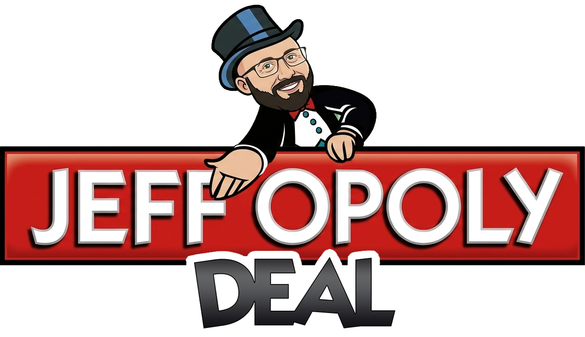

# Jeffopoly Deal 🎩🃏

[](https://github.com/JeffSteinbok/jeffopolydeal/actions/workflows/ci.yml)
[](https://github.com/JeffSteinbok/jeffopolydeal/actions/workflows/deploy.yml)
[](https://github.com/JeffSteinbok/jeffopolydeal/actions/workflows/health-check.yml)

<p align="center">
  
</p>

A real-time multiplayer **Monopoly Deal** card game built with React, ASP.NET Core, and SignalR. Play with friends in your browser — no installs needed.

## Table of Contents

- [Tech Stack](#tech-stack)
- [Project Structure](#project-structure)
- [Getting Started](#getting-started)
- [Deployment](#deployment)
- [Debug Mode](#debug-mode)
  - [Debug Flags](#debug-flags)
  - [Helpful Combinations](#helpful-combinations)
  - [Debug Console](#debug-console)
  - [Special Routes](#special-routes)
  - [Themes](#themes)
- [Game Configuration](#game-configuration)
- [Contributing](#contributing)
- [License](#license)


---

## Tech Stack

| Layer | Technology |
|---|---|
| **Frontend** | React 19, TypeScript 5.9, Vite 8 |
| **Backend** | ASP.NET Core (.NET 10), SignalR |
| **Testing** | Vitest + jsdom + React Testing Library (frontend), xUnit (backend) |
| **Bot AI** | Custom SmartBotAI library ([how it works](src/JeffopolyDeal.BotAI/README.md)) |
| **CI/CD** | GitHub Actions → Azure Web App |

---

## Project Structure

```
├── src/
│   ├── JeffopolyDeal.Shared/    # Shared models & card definitions
│   │   ├── Models/              # Card, Player, PropertySet, Deck, GameConfig
│   │   └── Cards/               # Card playability logic
│   ├── JeffopolyDeal.Game/      # ASP.NET Core game engine & SignalR hub
│   │   ├── Hubs/                # SignalR GameHub
│   │   ├── Themes/              # Theme JSON files
│   │   ├── Game.cs              # Core game logic
│   │   └── GameCache.cs         # In-memory game store
│   ├── JeffopolyDeal.BotAI/     # Smart bot AI library (see README)
│   │   ├── SmartBotAI.cs        # Strategic turn play & responses
│   │   ├── BoardAnalyzer.cs     # Game state evaluation & threats
│   │   ├── CardEvaluator.cs     # Card priority scoring
│   │   └── PaymentSolver.cs     # Optimal payment selection
│   └── web/                     # React frontend
│       ├── pages/               # Game, lobby, home pages
│       ├── components/          # Shared UI components
│       ├── utilities/           # Debug, logging, helpers (+ unit tests)
│       └── Types.ts             # TypeScript type definitions
├── tests/
│   ├── JeffopolyDeal.Game.Tests/  # xUnit game engine tests
│   └── JeffopolyDeal.BotAI.Tests/ # xUnit bot AI tests
├── public/                      # Static assets
├── wwwroot/                     # Vite build output (served by backend)
├── .github/workflows/           # CI, deploy, health-check
├── vite.config.ts               # Vite config (proxies /hub, /api to backend)
└── package.json
```

---

## Getting Started

See [**DEVELOPMENT.md**](DEVELOPMENT.md) for full build, run, debug, and testing instructions.

**Quick start:**

```bash
# Terminal 1 — Backend
dotnet run --project src/JeffopolyDeal.Game/JeffopolyDeal.Game.csproj

# Terminal 2 — Frontend (dev server with hot reload)
npm install && npm run dev
```

Then open `http://localhost:5173` in your browser.

---

## Deployment

Deployment is fully automated via GitHub Actions:

1. **CI** (`.github/workflows/ci.yml`) — builds and tests both frontend and backend on every push/PR to `main`
2. **Deploy** (`.github/workflows/deploy.yml`) — builds, publishes, and deploys to Azure Web App
3. **Health Check** (`.github/workflows/health-check.yml`) — scheduled every 15 minutes + post-deploy verification

> ⚠️ Never deploy manually. All deployments go through GitHub Actions CI/CD.

---

## Debug Mode

Append `?debug=<hexFlags>` to the URL to enable debug features. Flags are combined via bitwise OR.

**Example:** `http://localhost:5173/?debug=26`

### Debug Flags

All flags are defined in [`src/web/utilities/Debug.ts`](src/web/utilities/Debug.ts).

| Flag | Hex | Description |
|---|---:|---|
| `VerboseLogging` | `0x01` | Enables detailed `[DEBUG]` console logging via `Logger.debug()` — logs game state updates, SignalR messages, etc. |
| `FixedGameCode` | `0x02` | Forces new game code to `TEST` instead of a random code — useful for consistent testing and rejoining |
| `SkipLobby` | `0x04` | Bypasses the lobby waiting room and auto-starts the game immediately after creation |
| `ShowDeck` | `0x08` | Shows the debug deck viewer panel — displays draw pile, discard pile, and all player hands |
| `PopulatedBoards` | `0x10` | Auto-adds 3 AI bots with randomly pre-populated property boards — great for testing mid/late-game scenarios |
| `PlayVsAi` | `0x20` | Adds 3 AI bots that play normally from the start — for testing full game flow against opponents |
| `SkipToGameOver` | `0x40` | Jumps directly to the Game Over screen with mock completed sets — for testing end-game UI |

### Helpful Combinations

| Code | Flags | Use Case |
|---:|---|---|
| `0x06` | SkipLobby + FixedGameCode | Quick solo test — jump straight into a game with code `TEST` |
| `0x0E` | SkipLobby + FixedGameCode + ShowDeck | Solo test with full deck viewer for inspecting draw/discard piles |
| `0x16` | SkipLobby + FixedGameCode + PopulatedBoards | Jump into a game where all bots already have properties on board |
| `0x24` | SkipLobby + PlayVsAi | Fast game vs 3 AI bots (random game code) |
| `0x26` | SkipLobby + FixedGameCode + PlayVsAi | Fast game vs 3 AI bots with fixed code `TEST` |
| `0x44` | SkipLobby + SkipToGameOver | Test the Game Over screen UI immediately |
| `0x7F` | All flags | Everything enabled |

### Debug Console

When any debug flag is active, a debug console input appears in the game header (next to the Jeffopoly logo). Type a command and press Enter to execute it. The game state refreshes automatically after each command.

#### Commands

| Command | Description | Example |
|---|---|---|
| `give money <value>` | Add a money card to your hand | `give money 5` |
| `give rent <color>` | Add a rent card for that color pair | `give rent pink` |
| `give wildrent` | Add a wild rent card (any color) | `give wildrent` |
| `give house` | Add a House card | `give house` |
| `give hotel` | Add a Hotel card | `give hotel` |
| `give dealbreaker` / `give db` | Add a Deal Breaker card | `give db` |
| `give slydeal` / `give sly` | Add a Sly Deal card | `give sly` |
| `give forcedeal` / `give force` | Add a Forced Deal card | `give force` |
| `give jsn` / `give justsayno` | Add a Just Say No card | `give jsn` |
| `give passgo` / `give go` | Add a Pass Go card | `give go` |
| `give debt` / `give debtcollector` | Add a Debt Collector card | `give debt` |
| `give birthday` | Add an It's My Birthday card | `give birthday` |
| `give double` / `give doublerent` | Add a Double The Rent card | `give double` |
| `give wild` | Add a multicolor property wildcard | `give wild` |
| `give <color>` | Add a property card of that color | `give brown` |
| `bank <value>` | Add money directly to your bank | `bank 10` |
| `clear hand` | Remove all cards from your hand | `clear hand` |
| `clear bank` | Remove all cards from your bank | `clear bank` |
| `myturn` / `skip` | Skip to your turn immediately | `myturn` |
| `giveto <name> <card>` | Give a card to another player | `giveto Bot1 rent pink` |

#### Color Shortcuts

Colors can be specified as full names or abbreviations:

| Color | Accepted Values |
|---|---|
| Brown | `brown`, `brn` |
| Light Blue | `lightblue`, `lb`, `light` |
| Pink | `pink`, `pnk` |
| Orange | `orange`, `org` |
| Red | `red` |
| Yellow | `yellow`, `yel` |
| Green | `green`, `grn` |
| Dark Blue | `darkblue`, `db`, `dark` |
| Railroad | `railroad`, `rr`, `rail` |
| Utility | `utility`, `util` |

### Special Routes

| URL | Description |
|---|---|
| `?page=deck` | Deck test page — renders all 106 cards |
| `/api/deck` | API endpoint — returns full deck JSON |

### Themes

Property names and category labels (e.g., "Stadium" vs "Railroad") are defined in JSON theme files under `src/backend/Themes/`.

| Theme | File | Description |
|---|---|---|
| `jeffopoly` | `jeffopoly.json` | Default theme with custom property names |
| `classic` | `classic.json` | Classic Monopoly property names |

Use the `?theme=` query string parameter to select a theme:
- `?theme=classic` — uses classic Monopoly names
- `?theme=jeffopoly` or omitted — uses Jeffopoly names
- Any unrecognized value falls back to `jeffopoly`

The theme parameter works on both the main game and the deck test page (`?page=deck&theme=classic`).

To create a new theme, add a JSON file to `src/backend/Themes/` with this structure:

```json
{
    "name": "My Theme",
    "categoryNames": {
        "Railroad": "Railroad",
        "Utility": "Utility"
    },
    "properties": {
        "Brown": ["Name 1", "Name 2"],
        "LightBlue": ["Name 1", "Name 2", "Name 3"],
        ...
    }
}
```

---

## Game Configuration

Core game constants are in [`src/backend/Models/GameConfig.cs`](src/backend/Models/GameConfig.cs):

| Setting | Value |
|---|---|
| Initial hand size | 5 |
| Cards drawn per turn | 2 |
| Cards drawn when hand empty | 5 |
| Max plays per turn | 3 |
| Max hand size | 7 |
| Sets to win | 3 |
| Debt Collector amount | 5M |
| Birthday amount | 2M |
| House rent bonus | +3M |
| Hotel rent bonus | +4M |

---

## Contributing

All changes go through pull requests — **never push directly to `main`**.

1. Create a feature branch from `main`
2. Make your changes and ensure tests pass (`npm run test` and `dotnet test src/backend.Tests`)
3. Open a pull request targeting `main`
4. Wait for CI to pass (both frontend and backend checks)
5. Merge via the GitHub UI (squash or merge commit — no `--admin` bypass)

If your branch is behind `main`, rebase first, then merge normally.

> ⚠️ Direct pushes to `main` are not allowed. Always use the PR/merge workflow.

---

## License

This project is licensed under the MIT License. See [LICENSE.md](LICENSE.md) for details.
